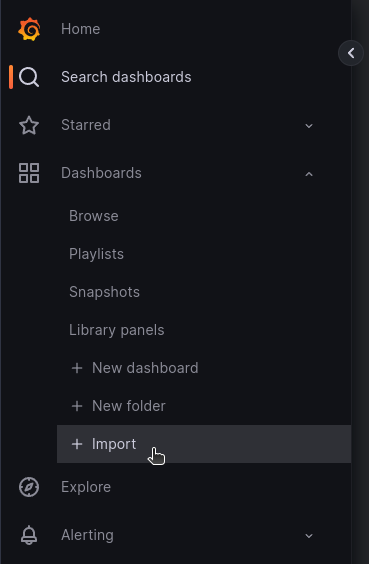
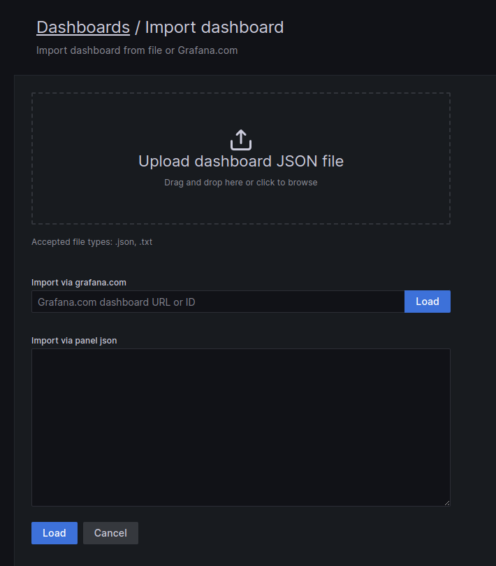
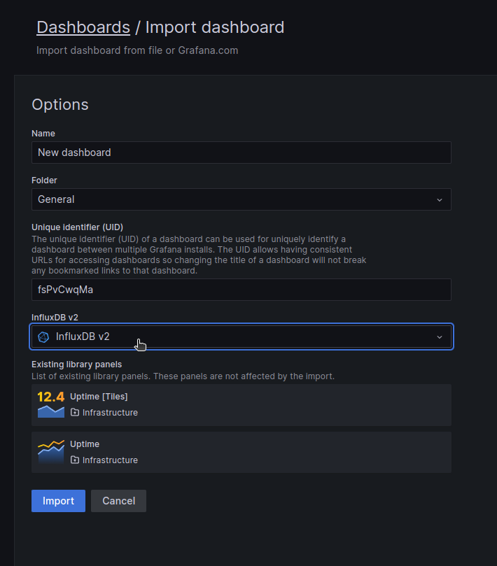
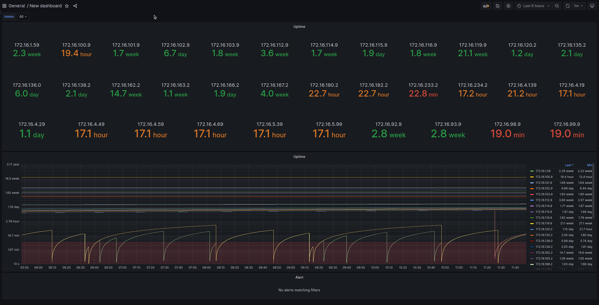

# grafana

This repository contains a set of shareable grafana dashboards, showing data collected by v//telemetry. The dashboards include reusable grafana library panels.

## Requirements

- [vtelemetry](https://hub.docker.com/r/arkonatechnologies/vtelemetry2)
- [Grafana](https://grafana.com/grafana/download)
- [InfluxDB](https://docs.influxdata.com/influxdb/v2.6/install/)

For further information of the setup process, read the chapter "monitoring" of our [quick start guide](https://www.dropbox.com/home/Public%20Downloads/VM/Guides/QuickStartGuide?preview=Quick_Start_Guide.pdf)

For best compatibility, install the latest influxdb with ["dbrp mapping"](https://docs.influxdata.com/influxdb/cloud/query-data/influxql/dbrp/), with which you can use both flux and also influxQL.
For a quick setup with influx running as a container, you can set it up with automatic dbrp mapping by setting following environment variables:

```
docker run -d --name=influxdb2 --net=host \
    [..]
    -e DOCKER_INFLUXDB_INIT_MODE=setup \
    -e DOCKER_INFLUXDB_INIT_USERNAME=<username> \
    -e DOCKER_INFLUXDB_INIT_PASSWORD=<password> \
    -e DOCKER_INFLUXDB_INIT_ORG=<organization> \
    -e DOCKER_INFLUXDB_INIT_BUCKET=<bucket name> \
    -e V1_DB_NAME=<database name for influxQL, e.g. same as bucket name> \
    -e V1_RP_NAME=default \
    -e V1_AUTH_USERNAME=<v1 username> \
    -e V1_AUTH_PASSWORD=<v1 password> \
    [..]
    influxdb:latest
```

## Usage

To load a dashboard, go to your grafana homepage and select "dashboards -> import" in the menu.



Select the json to upload from your computer or copy the json content to the text area.



Select the database to which vtelemetry sends its data and click "import".



The dashboard is loading afterwards and should be presented to you.



More information on [Grafana - Manage Dashboards](https://grafana.com/docs/grafana/latest/dashboards/manage-dashboards/)
